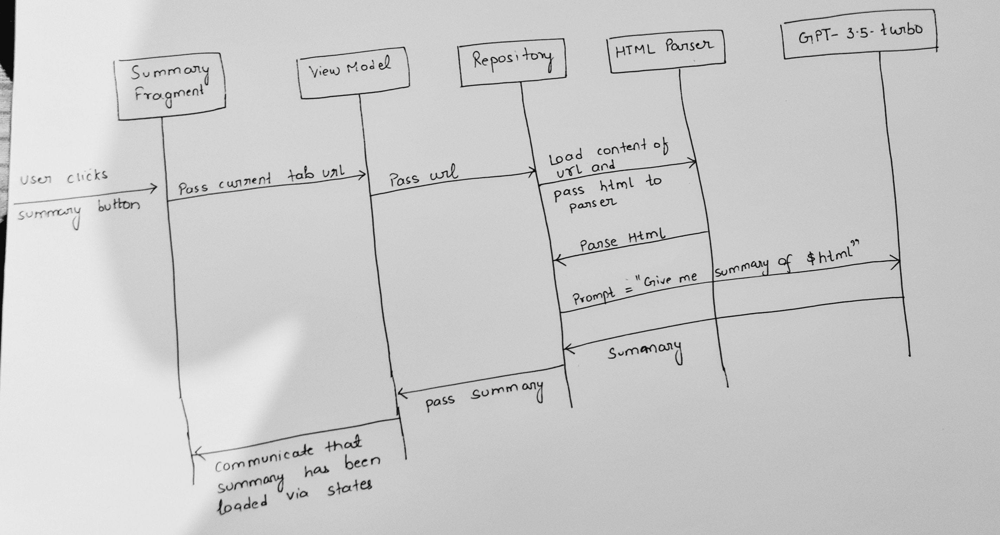

# Adding "Summarize Page" capability to Fenix using gpt-3.5-turbo

## Demo
https://drive.google.com/file/d/1rnXxLXJRiUS13fVYNtObEup_J6Lcqq76/view?usp=sharing

## Download/Build apk
1. Link to download apk - https://1drv.ms/f/s!AgzjizkELD-xl2ayDS6ieygzeXQ8?e=3TeR1B (Github doesn't allow LFS objects in public forks for non-enterprise users)
2. For building it yourself, clone this repo and put OpenAi api key in `PageSummaryRepository.kt` on line 13

## Approach
1. Add an option to "Summarize Page" in 3-dots action menu
2. When user clicks on it, show a fragment with page summary
3. Add indeterminate linear progress indicator to show loading
4. Add snackbar for conveying error
5. Add refresh button for retrying
6. Add back button with slide-in and out animations to return back to the webpage

## Data flow diagram

## HTML parsing
There are two strategies for html parsing:
1. Primary: Get the content inside "p" and "h1" tags using `Jsoup` and send those to gpt
2. Secondary: If the content length parsed using the above strategy was less then minimum threshold then we remove all the html tags and use chunking (describe in next section)
### Chunking
GPT apis have limit on number of tokens sent per request. In case, page content is exceding the limit, we divide the page into chunks and pick up non adjacent chunks (so most of the content is included in request).

## Limitations
1. I could not find a way to get the current page content in `GeckoEngine` class. So, we have to fetch the page again via okhttp and then make another network call to gpt apis to get summary. Pages which require additional authentication, will not work in this approach
2. We parse the html response and send it to gpt. If most of the content was loaded using JS, then summary would not be good
3. GPT response is slow due to free api key

